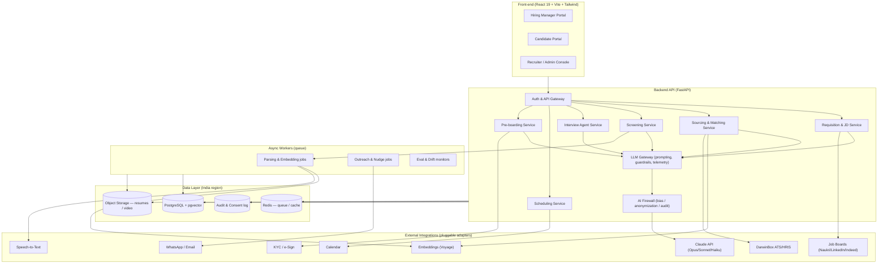
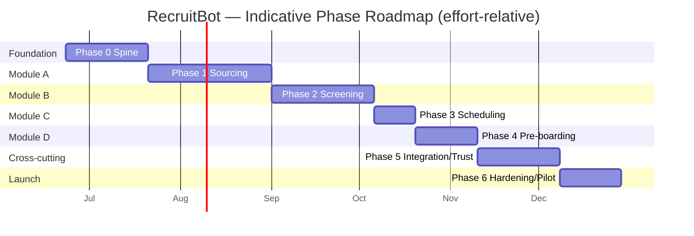

# RecruitBot — Phase-Wise Implementation Plan

**An End-to-End Agentic Recruitment Orchestrator**
*From job requisition to first day of onboarding.*

> Source of truth: `SOW for Recruitment.docx`
> Plan authored: 2026-06-18
> Status: Planning baseline (v1)

---

## Table of Contents

1. [Executive Summary](#1-executive-summary)
2. [Current State Assessment (Gap Analysis)](#2-current-state-assessment-gap-analysis)
3. [Target Architecture](#3-target-architecture)
4. [Technology Stack & Key Decisions](#4-technology-stack--key-decisions)
5. [Cross-Cutting Principles](#5-cross-cutting-principles)
6. [Testing Strategy & Definition of Done](#6-testing-strategy--definition-of-done)
7. [Phase & Sprint Breakdown](#7-phase--sprint-breakdown)
   - [Phase 0 — Foundation & Platform Spine](#phase-0--foundation--platform-spine)
   - [Phase 1 — Module A: Intelligent Sourcing & Job Distribution](#phase-1--module-a-intelligent-sourcing--job-distribution)
   - [Phase 2 — Module B: Cognitive Screening & Assessments](#phase-2--module-b-cognitive-screening--assessments)
   - [Phase 3 — Module C: Automated Scheduling & Coordination](#phase-3--module-c-automated-scheduling--coordination)
   - [Phase 4 — Module D: Pre-boarding & Document Management](#phase-4--module-d-pre-boarding--document-management)
   - [Phase 5 — Integration, Compliance & Trust](#phase-5--integration-compliance--trust-part-ii)
   - [Phase 6 — Hardening, Pilot & Launch](#phase-6--hardening-pilot--launch)
8. [Requirements Traceability Matrix](#8-requirements-traceability-matrix)
9. [KPI & Acceptance Criteria Validation](#9-kpi--acceptance-criteria-validation)
10. [Risk Register](#10-risk-register)
11. [Assumptions & Open Questions](#11-assumptions--open-questions)
12. [Indicative Roadmap](#12-indicative-roadmap)

---

## 1. Executive Summary

The SOW defines an **autonomous, 24/7 AI recruiter** that orchestrates the full hiring lifecycle across four functional modules (A–D), plus a cross-cutting layer of integration, multilingual, safety, and compliance requirements (Part II). The headline business goals are **Time-to-Hire reduced >40%**, **Candidate NPS >4.5/5**, **>95% AI/human shortlist agreement**, and **30–40% lower cost-per-hire**.

**Where we are today:** the repository is a *visually polished but functionally hollow demo* — a React/Tailwind front-end with two persona views (Hiring Manager, Candidate Portal) driven entirely by hardcoded data and `setTimeout` animations, plus a 2-line FastAPI backend exposing only a health check. There is **no AI, no database, no integrations, and no front-end↔back-end wiring**. Roughly **5% of the envisioned product exists, and it is entirely cosmetic.**

**Where we are going:** this plan converts that shell into the real system across **7 phases / 27 sprints**. It is deliberately sequenced so that:

- **Phase 0 builds the spine** (data model, LLM service, auth, wiring) that every later module depends on.
- **Phases 1–4 deliver Modules A–D**, each demoable end-to-end on completion.
- **Phase 5 hardens the cross-cutting Part II requirements** (DarwinBox, 13 languages, AI firewall, India data residency).
- **Phase 6 validates against the SOW's measurable acceptance criteria** and pilots to production.

Every sprint carries explicit **testing and exit criteria**; every phase ends with a **Validation Gate** tied directly to SOW success metrics. Where the SOW requires external systems that are legally or contractually gated (LinkedIn crawling, job-board posting, KYC, e-signature), the plan ships a **pluggable adapter with a simulated implementation** so the product is demoable now and production-ready when credentials/partnerships land — these are flagged explicitly in the [Risk Register](#10-risk-register).

---

## 2. Current State Assessment (Gap Analysis)

### 2.1 What exists today

| Area | File(s) | Reality |
|---|---|---|
| App shell + persona toggle | `src/App.tsx` | ✅ Real, working |
| Hiring Manager view | `src/components/HiringManagerView.tsx` | 🟡 UI only — scripted `setTimeout` log feed → hardcoded dashboard (2 static candidates, static stats) |
| Candidate Portal view | `src/components/CandidatePortalView.tsx` | 🟡 UI only — fake "upload" (no file picker), fake parse spinner, chat returns **one hardcoded reply** regardless of input |
| Backend API | `app.py` | 🔴 `/api/health` only; CORS configured; nothing else |
| Build tooling | Vite 8 / TS 6 / Tailwind v4 / ESLint | ✅ Configured |
| Front-end ↔ back-end wiring | — | 🔴 None; UI never calls the API |
| Data model / database | — | 🔴 None |
| AI / LLM integration | — | 🔴 None (no SDK, no model calls, no embeddings) |
| Auth / roles | — | 🔴 None |
| Tests / CI | — | 🔴 None |

### 2.2 Gap against the SOW

| SOW capability | Required | Today | Gap |
|---|---|---|---|
| **A** — JD generation (GenAI, inclusive) | ✅ | ❌ | Full build |
| **A** — Multi-channel posting (Naukri/LinkedIn/Indeed) | ✅ | ❌ (faked badges) | Adapters + simulation |
| **A** — High-Performer Archetype (perf/CRM ingest, success vectors) | ✅ | ❌ | Full build (needs data model + embeddings) |
| **A** — Silver Medalists / referrals (ATS mining, vector search) | ✅ | ❌ | Full build |
| **A** — Look-alike passive sourcing + churn signals | ✅ | ❌ | Full build (gated by data access) |
| **A** — Warm-up outreach + warmth scoring | ✅ | ❌ | Full build |
| **B** — Multimodal parsing (PDF/DOCX/image) | ✅ | ❌ (fake spinner) | Full build |
| **B** — Video intro → soft-skill markers | ✅ | ❌ | Full build (transcription + frames) |
| **B** — Anomaly detection (gaps, resume↔LinkedIn) | ✅ | ❌ | Full build |
| **B** — Weighted Fit Score (30/40/30) + bias-blind | ✅ | ❌ (static %) | Full build |
| **B** — Async AI interviewer (dynamic questioning) | ✅ | ❌ (1 canned reply) | Full build |
| **B** — Candidate Snapshot (Vibe / Red Flags / Top 3) | ✅ | ❌ (static text) | Full build |
| **C** — Calendar sync, rescheduling, WhatsApp/Email nudges | ✅ | ❌ | Full build |
| **D** — KYC, e-signature, pre-boarding FAQ bot | ✅ | ❌ | Full build |
| **II** — DarwinBox bi-directional sync | ✅ | ❌ | Full build (partner API) |
| **II** — 13 vernacular languages | ✅ | ❌ | Full build |
| **II** — AI firewall / bias detection / HITL / drift | ✅ | ❌ | Full build |
| **II** — Data residency India, consent, encryption | ✅ | ❌ | Full build |

**Conclusion:** the UI is a strong *clickable prototype* of Modules A & B and should be retained as the front-end skeleton. Everything behind it must be built. The single most valuable first move is **Phase 0** — giving the system a spine (DB + LLM service + auth + wiring) so the existing fakes can be replaced one flow at a time.

---

## 3. Target Architecture

**Service decomposition rationale:** modules map to bounded services so they can be built, tested, and demoed independently. The **LLM Gateway** and **AI Firewall** are shared chokepoints — every model call routes through them so prompting, cost/latency telemetry, anonymization, and bias/audit logging are enforced uniformly rather than reimplemented per feature.

---

## 4. Technology Stack & Key Decisions

| Layer | Choice | Rationale |
|---|---|---|
| Front-end | **React 19 + Vite + Tailwind v4** (existing) | Already in place and polished; keep. |
| Backend | **FastAPI (Python)** (existing) | Already chosen; strong async + Pydantic typing; good AI ecosystem. |
| LLM | **Claude** — `claude-opus-4-8` (reasoning: fit scoring, interview agent, JD), `claude-sonnet-4-6` (parsing, summarization, throughput), `claude-haiku-4-5-20251001` (high-volume: FAQ bot, classification, anonymization) | Tier by task to balance quality vs. cost/latency; multimodal (PDF/image) native. |
| Embeddings | **Voyage AI** (or self-hosted alternative) into **pgvector** | "Career DNA" / look-alike / silver-medalist matching is semantic vector search. |
| Video | **Speech-to-text** + sampled frames → Claude | Claude does not ingest raw video; transcribe audio + analyze frames/transcript. |
| Voice interview | **Speech-to-text (STT) + text-to-speech (TTS)** around the interview agent | Voice + chat are **both in v1 scope** (confirmed); voice adds STT/TTS + latency engineering. |
| Database | **PostgreSQL + pgvector** | Relational core + vector search in one engine; deployable in an India region. |
| Object storage | **S3-compatible, India region** | Resumes, videos, contracts; satisfies data-residency requirement. |
| Async / queue | **Redis + worker (RQ/Celery)** | Agentic sourcing, parsing, outreach, drift monitors are long-running/background. |
| Auth | **OIDC / JWT, role-based** (Hiring Manager, Candidate, Recruiter/Admin) | Distinct portals + audit need identity from day one. |
| Eval / observability | **LLM eval harness + tracing + cost dashboards** | AI quality is a first-class, testable artifact (golden sets, regression). |
| Integrations | **Adapter pattern** with `Simulated` + `Real` implementations | Demoable now; swap to real APIs (DarwinBox, boards, KYC, e-sign) when available. |

> **Model IDs are pinned** in a single config so upgrades are one-line and auditable. All model traffic is logged (prompt hash, tokens, latency, cost) via the LLM Gateway.

---

## 5. Cross-Cutting Principles

These are **built in from Phase 0, not bolted on later**, and are re-validated in Phase 5:

1. **Bias-blind by construction** — an anonymization layer strips protected attributes (gender, age, ethnicity, name/photo where feasible) *before* scoring; scoring prompts never receive them.
2. **Human-in-the-loop** — AI outputs are *recommendations*; every consequential action (shortlist, reject, outreach send, offer) has a human gate or override. (SOW: final hiring decisions are out of scope for AI.)
3. **Auditability** — every AI decision logs inputs (hashed), model+version, prompt version, output, and the human who actioned it.
4. **Data residency & minimization** — all PII storage/processing in India region; collect the minimum; encrypt at rest and in transit; consent captured and revocable.
5. **Multilingual-ready** — all candidate-facing copy and agent prompts are designed for i18n from the start (full 13-language rollout in Phase 5).
6. **Demoable at every phase** — simulated adapters keep the product runnable end-to-end even before real integrations exist.
7. **Eval-driven AI** — no AI feature ships without a golden test set and a regression gate.

---

## 6. Testing Strategy & Definition of Done

### 6.1 Testing taxonomy

| Level | What it validates | When it runs |
|---|---|---|
| **Unit** | Individual functions/components | Every commit (CI) |
| **Integration** | Service ↔ DB ↔ queue ↔ adapter | Every sprint |
| **Contract** | External adapter conforms to expected API shape (real & simulated parity) | Every sprint touching an integration |
| **E2E** | Full user journey through the UI | Every sprint with UI changes; full suite per phase |
| **LLM / AI eval** | Output quality vs. golden datasets; regression vs. baseline | Every AI sprint + nightly |
| **Bias / fairness** | Score parity across protected groups; anonymization leak checks | Every scoring/decision sprint + per phase |
| **Security** | Authz, injection (incl. prompt injection), PII exposure, secrets | Per phase + pre-launch pen-test |
| **Performance / load** | Latency & throughput vs. SOW ("<30s full profile + summary") | Per phase + Phase 6 |
| **UAT (human-in-loop)** | Recruiter/manager acceptance, override flows | End of each phase |
| **Acceptance (KPI)** | SOW success metrics & KPIs | Phase 6 + ongoing |

### 6.2 Definition of Done (every sprint)

A sprint is **Done** only when: code merged behind tests · unit+integration green in CI · new AI behavior has a golden eval set with a passing threshold · UI changes have an E2E happy-path · docs/README updated · demo script runnable · exit criteria checklist fully checked.

### 6.3 Per-phase Validation Gate

Each phase closes with a **Validation Gate** — a sign-off checklist that runs the full regression suite for that phase and verifies the SOW metric(s) the phase is accountable for. A phase does not "complete" until its gate passes; failures become carry-over backlog, explicitly logged (no silent scope drops).

---

## 7. Phase & Sprint Breakdown

> **Cadence assumption:** ~1–2 week sprints, small cross-functional team. Durations are *effort-relative*, not committed dates — see [Assumptions](#11-assumptions--open-questions). Each sprint block lists **Goal → Deliverables → Testing → Exit Criteria**.

---

### Phase 0 — Foundation & Platform Spine

**Objective:** give the system a real spine so every later feature has somewhere to live and the existing UI fakes can be replaced incrementally. **No SOW module is fully deliverable without this.**

#### Sprint 0.1 — Project setup, environments & CI/CD
- **Goal:** reproducible, deployable skeleton in an India region with secrets and pipelines.
- **Deliverables:** monorepo structure (frontend/backend/workers); Docker Compose for local; env/secrets management; CI (lint, typecheck, test); staging deploy to India-region infra; data-residency baseline documented.
- **Testing:** CI smoke (build + health check passes in staging); secrets-scanning in CI; infra region assertion test.
- **Exit Criteria:** ☐ `main` auto-deploys to staging ☐ health check green in cloud ☐ no plaintext secrets ☐ region = India verified.

#### Sprint 0.2 — Data model, database & synthetic seed data
- **Goal:** the canonical schema + realistic fake data the SOW demo depends on.
- **Deliverables:** Postgres + pgvector; schema for `employees` (+performance), `candidates`, `applications`, `resumes`, `jobs/requisitions`, `interviews`, `scores`, `consent`, `audit_log`; migrations; **seed generator** for synthetic top-performers, ATS history (incl. "silver medalists"), and candidate pools.
- **Testing:** migration up/down tests; seed integrity tests (referential, distributions); pgvector similarity sanity test.
- **Exit Criteria:** ☐ schema migrates cleanly ☐ seed produces ≥N employees/candidates with embeddings ☐ vector query returns ranked neighbours.

#### Sprint 0.3 — LLM Gateway & guardrail scaffold
- **Goal:** one audited chokepoint for all model traffic.
- **Deliverables:** LLM service wrapping Claude (model-tier config, retries, streaming); prompt-template registry with versioning; token/cost/latency telemetry; structured-output (JSON schema) helper; anonymization + audit hooks (stubbed firewall).
- **Testing:** unit tests on prompt rendering & schema validation; integration test hitting a live model with a fixture; telemetry assertion (every call logged); injection-resistance smoke test.
- **Exit Criteria:** ☐ a typed `generate(...)` call returns validated JSON ☐ every call appears in telemetry+audit ☐ model IDs pinned in config.

#### Sprint 0.4 — Auth, roles & first real wiring
- **Goal:** identity + prove the spine by killing the first fake.
- **Deliverables:** OIDC/JWT auth; roles (Hiring Manager, Candidate, Recruiter/Admin); protected API; front-end auth + API client; **replace the Hiring Manager `setTimeout` log feed with a real `POST /requisition` round-trip** (even if JD is a stub).
- **Testing:** authz tests (role matrix); E2E login → requisition submit → server response; CORS/security headers test.
- **Exit Criteria:** ☐ three roles enforced ☐ Hiring Manager flow calls real API ☐ no hardcoded data in that flow.

**🔒 Phase 0 Validation Gate:** ☐ deployable in India region ☐ DB + seed + vector search live ☐ all model traffic audited ☐ auth enforced ☐ at least one previously-fake flow now real end-to-end · *Run: full unit+integration suite, security smoke, region assertion.*

---

### Phase 1 — Module A: Intelligent Sourcing & Job Distribution

**Objective:** from a manager's plain-language brief, generate a JD, build the High-Performer Archetype, and source candidates internally + (simulated) externally with automated warm-up outreach.

#### Sprint 1.1 — Requisition intake & GenAI job descriptions
- **Goal:** real JD generation from the existing prompt box.
- **Deliverables:** requisition intake (structured + free-text); JD generation (Claude) tuned for **inclusive, high-converting** copy; bias-language linter on output; manager edit/approve loop; persisted requisition+JD.
- **Testing:** unit (intake parsing); AI eval — golden set of briefs → JD rubric scoring (inclusivity, completeness, tone); bias-language regression; E2E brief → JD → approve.
- **Exit Criteria:** ☐ JD generated & editable ☐ inclusivity linter passes on golden set ☐ JD persisted to requisition.

#### Sprint 1.2 — High-Performer Archetype engine
- **Goal:** the "anchor" the SOW makes prerequisite to sourcing.
- **Deliverables:** ingest performance/CRM/sales-dashboard data (from seed/adapters); compute **Success Vectors** (prev companies, tenure-to-promotion, education, summary tone) + **Skill Adjacency** (e.g., Pharma/Hospitality → Insurance); embed archetype; explainability view ("why these vectors").
- **Testing:** unit (vector computation); AI eval (adjacency suggestions vs. curated expectations); integration (archetype persisted + embedded); explainability snapshot test.
- **Exit Criteria:** ☐ archetype generated from top-10% data ☐ adjacency list produced ☐ archetype embedding queryable.

#### Sprint 1.3 — Multi-channel distribution (adapters + simulation)
- **Goal:** "post" a job across channels via pluggable adapters.
- **Deliverables:** distribution service; **adapter interface** with `Simulated` board implementations (Naukri/LinkedIn/Indeed) + a mock public job page; posting status tracking; the existing "LinkedIn Live / Naukri Live" badges become real status reflections.
- **Testing:** contract tests (adapter interface parity); integration (post → status); E2E (approve JD → posts appear with live status).
- **Exit Criteria:** ☐ job "posts" to ≥3 simulated channels ☐ statuses reflect real adapter responses ☐ real adapters swappable without service change.

#### Sprint 1.4 — Internal mining: Silver Medalists & referrals
- **Goal:** recycle ATS talent via vector search.
- **Deliverables:** **Silver Medalist** finder (prior final-stage, re-scored against new role via vector similarity to archetype); referral scanner over top-performer "extended network" (seed graph); ranked internal-candidate list surfaced in dashboard.
- **Testing:** unit (re-scoring); AI/vector eval (precision@K vs. labeled silver medalists in seed); integration; E2E (requisition → internal candidates listed).
- **Exit Criteria:** ☐ silver medalists surfaced & re-scored ☐ referrals ranked ☐ precision@K ≥ target on seed.

#### Sprint 1.5 — Passive sourcing: look-alikes & churn signals *(gated)*
- **Goal:** "look-alike" search + churn/timing signals over a **simulated** public dataset.
- **Deliverables:** vector look-alike search (Person A → similar Person B); churn/openness scoring from signals (boss promotion, layoffs, work anniversary) over simulated profiles; clear **provenance flags** distinguishing simulated vs. real sources.
- **Testing:** vector eval (look-alike relevance); unit (signal scoring); integration; **compliance review** of data sources (see Risk R-1).
- **Exit Criteria:** ☐ look-alikes ranked from archetype ☐ churn score computed ☐ every external profile provenance-flagged ☐ legal sign-off on data source approach.

#### Sprint 1.6 — Automated warm-up outreach & warmth scoring
- **Goal:** initiate relationships and hand warm leads to humans.
- **Deliverables:** hyper-personalized nudge generation (Claude, templated, multilingual-ready); send via simulated WhatsApp/Email adapter; link/click + reply tracking; **Warmth/Interest score**; HITL handoff to recruiter on warmth threshold.
- **Testing:** AI eval (nudge personalization/quality + no-PII-leak); unit (warmth scoring); integration (send → track → handoff); E2E (sourced lead → outreach → warmth → recruiter inbox).
- **Exit Criteria:** ☐ personalized nudges generated & "sent" ☐ engagement tracked ☐ warmth-threshold handoff works ☐ human approves before any real send.

**🔒 Phase 1 Validation Gate:** ☐ manager brief → JD → multi-channel post → internal+passive sourcing → warm outreach runs end-to-end ☐ archetype explainable ☐ all external sources provenance-flagged & legally reviewed · *Metric anchor:* baseline for **Candidate Engagement Rate (>80% target)** instrumented. *Run: Phase-1 E2E regression, vector eval suite, bias-language checks.*

---

### Phase 2 — Module B: Cognitive Screening & Assessments

**Objective:** turn a raw application into a parsed profile, a weighted bias-blind Fit Score, an AI interview, and a Candidate Snapshot — replacing the Candidate Portal and dashboard fakes.

#### Sprint 2.1 — Multimodal resume & profile parsing
- **Goal:** real upload → structured extraction (kills the fake spinner).
- **Deliverables:** real file upload to object storage; multimodal parsing (PDF/DOCX/image) via Claude; structured schema (skills, roles, tenure, education, certs); confidence scores; parsed profile UI.
- **Testing:** AI eval — **parsing accuracy vs. labeled corpus across formats** (SOW target: 98% / 50+ formats — tracked as a ramping metric); unit (schema); integration (upload → parse → persist); E2E (upload → profile shown).
- **Exit Criteria:** ☐ PDF/DOCX/image parse to structured profile ☐ accuracy measured & trending to target ☐ low-confidence fields flagged.

#### Sprint 2.2 — Video intro processing & anomaly detection
- **Goal:** soft-skill markers from video + integrity flags.
- **Deliverables:** video upload → speech-to-text + frame sampling → **soft-skill markers** (clarity, energy, professionalism); **anomaly detection** (employment gaps, resume↔LinkedIn inconsistencies via adapter).
- **Testing:** AI eval (soft-skill marker consistency on labeled clips; anomaly precision/recall on seeded inconsistencies); integration; E2E (video → markers shown).
- **Exit Criteria:** ☐ video → transcript + markers ☐ gaps/inconsistencies flagged ☐ graceful handling when no video provided.

#### Sprint 2.3 — Fit Score engine & bias mitigation
- **Goal:** the weighted, explainable, **bias-blind** Fit Score (replaces static %).
- **Deliverables:** scoring with SOW weights — **Hard Skills 30 / Experience Quality 40 / Behavioral Intent 30**; anonymization layer enforced pre-scoring; per-dimension breakdown + rationale; scores wired into the real dashboard cards.
- **Testing:** AI eval (score correlation vs. labeled "human" scores on seed); **bias/fairness tests** (score parity across protected groups; anonymization leak test — protected attrs never reach scorer); unit (weighting math); E2E.
- **Exit Criteria:** ☐ 30/40/30 score with breakdown ☐ anonymization verified (zero leaks) ☐ group-parity within tolerance ☐ dashboard shows real scores.

#### Sprint 2.4 — Asynchronous AI interviewer (dynamic questioning)
- **Goal:** replace the single canned chat reply with a real adaptive interviewer.
- **Deliverables:** interview agent (10–15 min) with **dynamic follow-ups grounded in prior answers** and the parsed profile; empathetic/professional persona; session state + transcript. **Both voice and chat in scope (v1):** chat UI plus a voice loop (STT in → agent → TTS out) with barge-in/turn handling; transcript unified across modes; guardrails against off-topic/prompt-injection.
- **Testing:** AI eval (follow-up relevance, persona adherence, stays on-task; red-team prompt-injection set); **voice tests** (STT accuracy on accented/multilingual audio, end-to-end voice latency, TTS intelligibility); integration (session persistence across modes); E2E (full interview transcript captured in both voice and chat).
- **Exit Criteria:** ☐ follow-ups demonstrably adapt to answers ☐ persona consistent ☐ **voice and chat both complete an interview** ☐ voice round-trip latency within target ☐ transcript persisted ☐ injection attempts contained.

#### Sprint 2.5 — Candidate Snapshot & Hiring Manager dashboard
- **Goal:** the manager-facing summary the SOW specifies, on real data.
- **Deliverables:** **Candidate Snapshot** = Vibe Check + Red Flags + Top 3 Reasons to Hire, generated from profile+interview; full Hiring Manager dashboard wired to live pipeline (applicants, screened, shortlisted); HITL shortlist/reject with override + audit.
- **Testing:** AI eval (snapshot faithfulness to source — no hallucinated claims); E2E (apply → parse → score → interview → snapshot on dashboard); UAT with a recruiter.
- **Exit Criteria:** ☐ snapshot generated & faithful ☐ dashboard fully live (no fakes) ☐ human shortlist/override audited.

**🔒 Phase 2 Validation Gate:** ☐ application → parse → score → interview → snapshot runs fully on real data ☐ bias-blind verified ☐ no remaining hardcoded UI in either portal · *Metric anchors:* **<30s full profile + summary** (perf test), **>90% AI↔human score correlation** (correlation study on seed), **parsing accuracy trend**. *Run: Phase-2 E2E, AI eval suite, fairness suite, latency benchmark.*

---

### Phase 3 — Module C: Automated Scheduling & Coordination

**Objective:** autonomously coordinate interviews across candidates and multiple interviewers with reminders and rescheduling.

#### Sprint 3.1 — Calendar sync & multi-interviewer booking
- **Goal:** real-time availability + booking.
- **Deliverables:** calendar adapter (simulated + real-ready); multi-interviewer availability resolution; candidate self-scheduling UI; booking + confirmations; timezone handling.
- **Testing:** unit (slot resolution, timezones); contract (calendar adapter); integration (book → event created); E2E (candidate books across N interviewers).
- **Exit Criteria:** ☐ availability computed across interviewers ☐ booking creates events ☐ conflicts prevented.

#### Sprint 3.2 — Autonomous rescheduling & nudges (WhatsApp/Email)
- **Goal:** hands-off reminders + rescheduling.
- **Deliverables:** reminder scheduler (worker); WhatsApp/Email nudge adapter (multilingual-ready); autonomous reschedule on conflict/no-response with HITL guardrail; delivery tracking.
- **Testing:** unit (scheduling logic); integration (nudge → delivery log); E2E (no-show → auto-reschedule → confirmation); rate-limit/opt-out compliance test.
- **Exit Criteria:** ☐ reminders fire on schedule ☐ auto-reschedule works ☐ opt-out honored.

**🔒 Phase 3 Validation Gate:** ☐ end-to-end scheduling incl. reschedule + nudges across channels ☐ no double-booking ☐ messaging compliance (opt-out, rate limits). *Run: Phase-3 E2E, adapter contract tests, compliance checks.*

---

### Phase 4 — Module D: Pre-boarding & Document Management

**Objective:** autonomous KYC, contract generation + e-signature, and a pre-boarding FAQ bot.

#### Sprint 4.1 — KYC / identity verification *(gated)*
- **Goal:** identity verification via pluggable provider.
- **Deliverables:** KYC adapter (simulated + real-ready); document capture; verification status + audit; consent capture for KYC data.
- **Testing:** contract (KYC adapter); integration (submit → status); security (PII handling, encryption); E2E.
- **Exit Criteria:** ☐ KYC flow completes with status ☐ consent + audit recorded ☐ PII encrypted.

#### Sprint 4.2 — Contract generation & e-signature tracking
- **Goal:** generate offer/contract docs and track signatures.
- **Deliverables:** templated contract generation (GenAI-assisted, human-approved); e-signature adapter (simulated + real-ready); signature status tracking; document storage (India region).
- **Testing:** unit (template fill); contract (e-sign adapter); integration (send → signed status); E2E (offer → sign → tracked).
- **Exit Criteria:** ☐ contract generated & human-approved ☐ e-sign status tracked ☐ docs stored compliantly.

#### Sprint 4.3 — Pre-boarding FAQ bot
- **Goal:** reduce new-hire anxiety; high autonomous resolution.
- **Deliverables:** RAG FAQ bot over company onboarding knowledge base; "first day" flows; escalation to human on low confidence; multilingual-ready.
- **Testing:** AI eval (answer accuracy + grounding on FAQ golden set; **autonomous-resolution rate**); integration; E2E; hallucination/grounding check.
- **Exit Criteria:** ☐ bot answers grounded FAQs ☐ escalates when unsure ☐ resolution-rate baseline instrumented (target >90%).

**🔒 Phase 4 Validation Gate:** ☐ pre-boarding runs end-to-end (KYC → contract → e-sign → FAQ) ☐ all PII compliant ☐ FAQ grounded with escalation. *Run: Phase-4 E2E, security review of doc/PII handling, FAQ eval.*

---

### Phase 5 — Integration, Compliance & Trust (Part II)

**Objective:** harden the cross-cutting Part II requirements that turn a demo into a deployable enterprise system.

#### Sprint 5.1 — DarwinBox ATS/HRIS bi-directional sync
- **Goal:** real two-way sync with the enterprise HR platform.
- **Deliverables:** DarwinBox adapter; bi-directional sync (candidates, statuses, hires); conflict resolution + idempotency; sync monitoring/retries.
- **Testing:** contract (DarwinBox API); integration (round-trip sync); reconciliation test (no data loss/dupes); failure/replay test.
- **Exit Criteria:** ☐ records sync both ways ☐ conflicts resolved deterministically ☐ sync observable + recoverable.

#### Sprint 5.2 — Multilingual (13 vernacular languages)
- **Goal:** full language coverage across UI + agents + outreach.
- **Deliverables:** UI i18n for 13 languages; language detection + agent responses in candidate's language; localized outreach/nudges/FAQ; quality review per language.
- **Testing:** AI eval (response quality per language); i18n coverage test (no missing keys); E2E in ≥3 representative languages incl. Hindi; native-reviewer spot-check.
- **Exit Criteria:** ☐ 13 languages selectable & functional ☐ agents respond in-language ☐ quality reviewed.

#### Sprint 5.3 — AI Firewall: bias detection, HITL, drift monitoring
- **Goal:** productionize the safety chokepoint.
- **Deliverables:** bias-detection filters on decisions; mandatory HITL gates on consequential actions; **model-drift monitors** (eval scores tracked over time, alerting); sample quality checks; full decision audit/explainability surfaced to recruiters.
- **Testing:** fairness suite (cross-group parity at scale); drift simulation test (alert fires); audit completeness test; red-team adversarial bias probes.
- **Exit Criteria:** ☐ biased outputs blocked/flagged ☐ HITL enforced on all consequential actions ☐ drift alerts working ☐ every decision auditable.

#### Sprint 5.4 — Data security, consent & India residency
- **Goal:** compliance posture for production.
- **Deliverables:** consent management (capture, revoke, propagate-to-delete); enforced India-region residency for all PII; encryption at rest+transit; data minimization + anonymization review; retention/deletion policies (DPDP-aligned).
- **Testing:** security pen-test (authz, injection, PII exposure); residency assertion (no PII egress); consent-revocation E2E (data deletion verified); encryption audit.
- **Exit Criteria:** ☐ consent capture+revoke works end-to-end ☐ residency proven ☐ encryption verified ☐ pen-test issues triaged/closed.

**🔒 Phase 5 Validation Gate:** ☐ DarwinBox sync stable ☐ 13 languages live ☐ AI firewall enforcing bias/HITL/drift ☐ data security + India residency + consent verified. *Run: full regression, fairness-at-scale, security pen-test, residency audit.*

---

### Phase 6 — Hardening, Pilot & Launch

**Objective:** prove the SOW's measurable acceptance criteria and roll out to production safely.

#### Sprint 6.1 — KPI instrumentation & acceptance validation
- **Goal:** measure the SOW's numbers, not just features.
- **Deliverables:** analytics for all KPIs (engagement, autonomous-resolution, screening accuracy/agreement, NPS capture, cost-per-hire model, time-to-hire); **AI↔human correlation study** harness; candidate NPS survey flow.
- **Testing:** acceptance tests asserting each KPI computed correctly; correlation-study dry run on seed/pilot data; dashboard accuracy validation.
- **Exit Criteria:** ☐ every SOW KPI measured live ☐ correlation study reproducible ☐ NPS capture working.

#### Sprint 6.2 — Performance, reliability & security hardening
- **Goal:** production-grade non-functionals.
- **Deliverables:** load/perf tuning to hit **<30s full profile+summary** under concurrency; resilience (retries, fallbacks, graceful degradation when an LLM/adapter is down); final security review; observability/alerting/runbooks.
- **Testing:** load test at projected volume; chaos/failure-injection; full security re-test; latency SLO verification.
- **Exit Criteria:** ☐ latency SLOs met under load ☐ graceful degradation proven ☐ security sign-off ☐ runbooks ready.

#### Sprint 6.3 — Pilot rollout & go-live
- **Goal:** controlled production launch with human calibration.
- **Deliverables:** pilot on one role/region with heavy HITL; calibration of scores/thresholds vs. real recruiter decisions; feedback loop; phased rollout plan; go/no-go review against acceptance criteria.
- **Testing:** real-world UAT with recruiters; shadow-mode comparison (AI vs. human shortlist agreement); pilot KPI readout vs. SOW targets.
- **Exit Criteria:** ☐ pilot meets/clears path to KPI targets ☐ recruiters accept ☐ go/no-go signed ☐ rollout plan approved.

**🔒 Phase 6 Validation Gate (Final Acceptance):** all SOW acceptance criteria & KPIs measured and met-or-on-credible-trajectory; human-in-the-loop verified across the lifecycle; security & compliance signed off. *Run: full system regression + acceptance suite + pilot readout.*

---

## 8. Requirements Traceability Matrix

| SOW Requirement | Phase | Sprint(s) |
|---|---|---|
| Auto-generate inclusive JDs | 1 | 1.1 |
| Multi-channel posting (Naukri/LinkedIn/Indeed) | 1 | 1.3 |
| High-Performer Archetype / Success Vectors / Skill Adjacency | 1 | 1.2 |
| Silver Medalists + Employee Referrals | 1 | 1.4 |
| Look-alike passive sourcing + churn signals | 1 | 1.5 |
| Warm-up outreach + Interest/Warmth scoring | 1 | 1.6 |
| Multimodal parsing (PDF/DOCX/image) | 2 | 2.1 |
| Video intro → soft-skill markers | 2 | 2.2 |
| Anomaly detection (gaps, resume↔LinkedIn) | 2 | 2.2 |
| Weighted Fit Score 30/40/30 | 2 | 2.3 |
| Bias mitigation (blind scoring) | 2, 5 | 2.3, 5.3 |
| Async AI interviewer + dynamic questioning | 2 | 2.4 |
| Candidate Snapshot (Vibe / Red Flags / Top 3) | 2 | 2.5 |
| Hiring Manager Dashboard (Fit Score + Snapshot) | 2 | 2.5 |
| Calendar sync (multi-interviewer) | 3 | 3.1 |
| Rescheduling + WhatsApp/Email nudges | 3 | 3.2 |
| KYC / identity verification | 4 | 4.1 |
| Contract generation + e-signature | 4 | 4.2 |
| Pre-boarding FAQ bot | 4 | 4.3 |
| DarwinBox ATS/HRIS bi-directional sync | 5 | 5.1 |
| 13 vernacular languages | 5 | 5.2 |
| AI Firewall / HITL / drift / sample QC | 5 | 5.3 |
| Data security, consent, India residency, encryption | 0, 5 | 0.1, 5.4 |
| KPI measurement & acceptance | 6 | 6.1, 6.3 |

---

## 9. KPI & Acceptance Criteria Validation

| SOW Metric | Target | How validated | Where |
|---|---|---|---|
| Time-to-Hire reduction | >40% | Pilot vs. baseline measurement | 6.1 / 6.3 |
| Parsing accuracy | 98% across 50+ formats | Labeled-corpus eval (ramping metric) | 2.1 |
| Review time | <30s full profile + summary | Latency benchmark under load | 2.5 / 6.2 |
| AI↔Human score alignment | >90% correlation | Correlation study on labeled/pilot data | 2.5 / 6.1 |
| Screening accuracy (shortlist agreement) | >95% | Shadow-mode AI vs. recruiter | 6.3 |
| Candidate NPS | >4.5/5 | Post-interview survey | 6.1 / 6.3 |
| Candidate engagement rate | >80% response | Outreach tracking analytics | 1.6 / 6.1 |
| Autonomous FAQ resolution | >90% | FAQ bot analytics | 4.3 / 6.1 |
| Cost-per-hire reduction | 30–40% | Cost model vs. agency baseline | 6.1 / 6.3 |
| Unqualified candidates reaching humans | −70% | Funnel analytics | 6.1 |

> Several AI-quality targets (98% parsing, >90% correlation) are **ramping metrics**: instrumented early, improved iteratively, and formally signed off in Phase 6. They are tracked from the sprint that introduces the capability so regressions surface immediately.

---

## 10. Risk Register

| ID | Risk | Impact | Mitigation |
|---|---|---|---|
| **R-1** | **LinkedIn / public web crawling** violates platform ToS and data-protection law | High (legal) | Use official APIs/partnerships where they exist; otherwise keep passive sourcing **simulated** with provenance flags; legal sign-off before any real scraping (gate in 1.5). |
| **R-2** | **Job-board posting** (Naukri/LinkedIn/Indeed) needs partner/API access | Medium | Adapter pattern; simulated until credentials secured; no hard dependency on any single board. |
| **R-3** | **DarwinBox** API access/scope unknown | Medium | Early discovery; contract tests; build against simulated adapter until access confirmed. |
| **R-4** | **Bias / DE&I non-compliance** in scoring | High (legal/ethical) | Anonymization-before-scoring; fairness test suite; AI firewall (5.3); human-in-the-loop on all decisions. |
| **R-5** | **Data residency / DPDP** non-compliance | High (legal) | India-region infra from Phase 0; encryption; consent mgmt; residency assertions in CI (0.1, 5.4). |
| **R-6** | **LLM hallucination** in snapshots/JDs/FAQ | Medium | Grounding + faithfulness evals; HITL approval on consequential outputs; citations where applicable. |
| **R-7** | **AI quality targets** (98% / >90%) not met early | Medium | Treat as ramping metrics; golden sets + regression gates; iterate before Phase 6 sign-off. |
| **R-8** | **Cost/latency** of multimodal + interview at scale | Medium | Model-tiering (Haiku/Sonnet/Opus); caching; async workers; latency SLOs in 6.2. |
| **R-9** | **Prompt injection** via resumes/chat | Medium | Input isolation, guardrails, red-team eval sets (2.4, 5.3). |
| **R-10** | **Messaging compliance** (WhatsApp/Email opt-out, rate limits) | Medium | Opt-out + consent honored; rate-limiting; compliance tests (3.2). |

---

## 11. Assumptions & Open Questions

**Confirmed decisions (locked):**
1. **Near-term goal = a real working demo, fast.** The committed focus is **Phase 0 → 1 → 2**, which replaces today's fakes with genuine AI end-to-end (brief → JD → sourcing → parse → Fit Score → interview → snapshot). Phases 3–6 follow to reach the full production system.
2. **Voice *and* chat AI interviewing are both in v1 scope** (Sprint 2.4) — includes STT/TTS and voice-latency engineering.
3. **All external integrations start simulated** (no confirmed partner/API access specified) behind the adapter pattern, and swap to real implementations when credentials/partnerships land — no real implementation is on the critical path for the demo.

**Standing assumptions (proceeding unless corrected):**
4. Small cross-functional team; **1–2 week sprints**; durations are effort-relative, not committed calendar dates.
5. **Claude** is the LLM of record; **Voyage** (or equivalent) for embeddings; **Postgres+pgvector** for storage/vector search.
6. The existing React front-end is retained and progressively wired to real APIs.
7. Synthetic/seed data is acceptable for development and demo; real enterprise data connects in Phase 5.

**Open questions to confirm (do not block the demo path, but affect Phases 3–6):**
- When integrations become real, which land first (DarwinBox, Naukri/LinkedIn/Indeed, KYC, e-sign, WhatsApp BSP, calendar)? Determines the order adapters get swapped from simulated → real.
- Target **launch role(s)/region(s)** for the pilot, and the **baseline** numbers to measure KPI deltas against.
- Hosting/cloud provider and the specific **India region** to standardize on.

---

## 12. Indicative Roadmap

**Recommended fastest path to a *real* (not faked) demo:** complete **Phase 0 → Phase 1 → Phase 2**. That delivers a genuinely functional Module A + B — manager brief → real JD → real sourcing → real parsing → real Fit Score → real adaptive interview → real Candidate Snapshot — which is the heart of the product. Phases 3–6 then take it from "impressive demo" to "deployable enterprise system."

---

*Living document — update the Validation Gates and Traceability Matrix as scope is confirmed and sprints close.*
